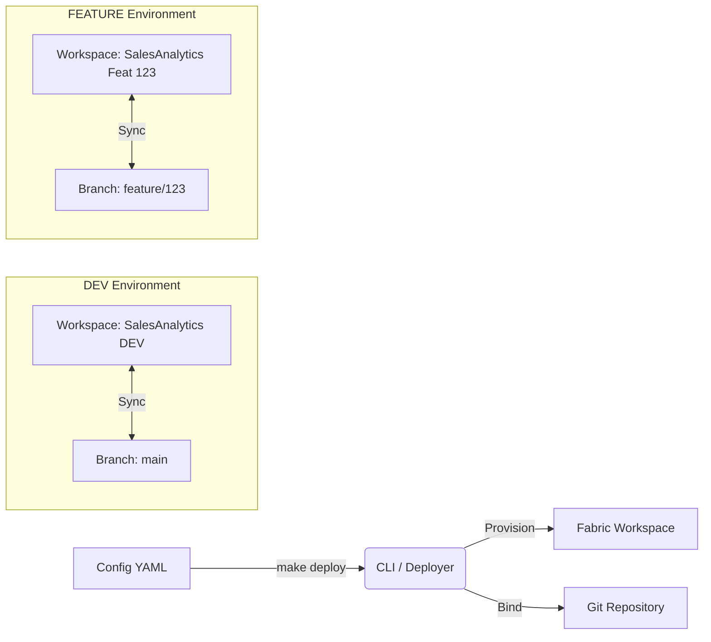

# Data Product Factory: Automated Workspace & Git Integration Guide

## Executive Summary

This guide outlines the **"Data Product Factory"** workflow using the `usf_fabric_cli_cicd` solution. It demonstrates how to automate the lifecycle of a Microsoft Fabric data product—from initial onboarding to feature-isolated development—while enforcing strict governance and naming standards.

**Target Audience:** Data Platform Engineers, Analytics Engineers, and DevOps Leads.

**Key Capabilities Demonstrated:**

* **Zero-Touch Provisioning:** Creating workspaces via CLI/API without manual portal interaction.
* **Git-First Governance:** Automatically binding Fabric workspaces to specific Git repositories and branches.
* **Environment Isolation:** Seamlessly spinning up ephemeral "Feature Workspaces" for safe development.
* **Dual-Mode Git:** Using a shared repository (default) or auto-creating an isolated per-project repo (`--create-repo`).
* **Standardization:** Enforcing folder structures and naming conventions via configuration templates.

---

## 1. Prerequisites

Before executing the workflows in this guide, ensure the following requirements are met:

* **Environment:**
  * Access to a Linux/WSL terminal with Python 3.11+.
  * The `fabric-cli-cicd` Conda environment is active.
* **Credentials:**
  * A `.env` file configured with your Service Principal credentials (`AZURE_CLIENT_ID`, `AZURE_CLIENT_SECRET`, `AZURE_TENANT_ID`).
  * A valid **Fabric Capacity ID** (F-SKU or Trial) set as `FABRIC_CAPACITY_ID`.
* **Version Control:**
  * A target Git repository (Azure DevOps or GitHub) initialized and accessible.
  * The repository URL set as `GIT_REPO_URL` in your `.env`.
  * Permissions to create branches and push code.

---

## 2. Workflow Overview

The "Data Product Factory" follows a strict lifecycle to ensure stability in `DEV` while allowing flexibility in `FEATURE` branches.



---

## 3. Phase 1: Product Definition (Configuration)

The foundation of the factory is the **Configuration File**. This YAML file follows the schema defined in `src/usf_fabric_cli/schemas/workspace_config.json` and is validated automatically on every deployment.

> **Tip:** Start from one of the 11 blueprint templates in `templates/blueprints/` instead of writing from scratch. The `basic_etl.yaml` or `medallion.yaml` blueprints cover most enterprise scenarios.

**Action:** Create a new file at `config/projects/sales_analytics/config.yaml`.

**Content:**

```yaml
# Workspace definition (required)
workspace:
  name: "sales-analytics-dev"
  display_name: "SalesAnalytics [DEV]"
  description: "Development environment for Sales Analytics product"
  capacity_id: "${FABRIC_CAPACITY_ID}"

  # Git integration (optional — uses env var substitution)
  git_repo: "${GIT_REPO_URL}"
  git_branch: "main"
  git_directory: "/sales-analytics"

# Folder structure (medallion architecture)
folders:
  - "Bronze"
  - "Silver"
  - "Gold"
  - "Notebooks"
  - "Pipelines"

# Data storage
lakehouses:
  - name: "raw_data_lakehouse"
    folder: "Bronze"
    description: "Raw data from source systems"

  - name: "processed_data_lakehouse"
    folder: "Silver"
    description: "Cleaned and validated data"

  - name: "analytics_lakehouse"
    folder: "Gold"
    description: "Business-ready analytics data"

# Analytics warehouse
warehouses:
  - name: "analytics_warehouse"
    folder: "Gold"
    description: "Primary analytics warehouse"

# Data processing notebooks
notebooks:
  - name: "data_ingestion"
    folder: "Notebooks"
    description: "Data ingestion from source systems"

  - name: "data_transformation"
    folder: "Notebooks"
    description: "Data cleaning and transformation"

# Orchestration pipelines
pipelines:
  - name: "daily_etl_pipeline"
    folder: "Pipelines"
    description: "Daily ETL orchestration pipeline"

# Security & Access Control
# NOTE: Use Object IDs (GUIDs) for all principals. Email addresses are not
# supported by the Fabric API for principal assignment.
principals:
  - id: "${DEV_ADMIN_OBJECT_ID}"
    role: "Admin"

  - id: "${DEV_CONTRIBUTOR_OBJECT_ID}"
    role: "Contributor"

  - id: "${AZURE_CLIENT_ID}"
    role: "Contributor"
```

> **Note:** All `${...}` placeholders are automatically substituted from your `.env` file at deployment time. See `.env.template` for the full list of supported variables.

### Environment Overrides

The system supports **environment-specific overrides** via files in `config/environments/`. When you pass `--env dev`, the CLI merges `config/environments/dev.yaml` into your project config:

```yaml
# config/environments/dev.yaml — applied when --env dev is used
workspace:
  capacity_id: "${FABRIC_CAPACITY_ID}"
  git_branch: main

# Mandatory principals injected for all dev workspaces
principals:
  - id: "${ADDITIONAL_ADMIN_PRINCIPAL_ID}"
    role: "Admin"
    description: "Mandatory Additional Admin"

  - id: "${ADDITIONAL_CONTRIBUTOR_PRINCIPAL_ID}"
    role: "Contributor"
    description: "Mandatory Additional Contributor"
```

---

## 4. Phase 2: Deploying the DEV Environment

This step fulfils the requirement to **automatically create a DEV workspace** and **link it to the MAIN Git repo**.

**Command:**

```bash
make deploy config=config/projects/sales_analytics/config.yaml env=dev
```

**What Happens Behind the Scenes:**

1. **Authentication:** The CLI authenticates using the Service Principal from `.env`.
2. **Config Loading:** The `ConfigManager` loads `config.yaml`, substitutes `${ENV_VARS}`, merges `config/environments/dev.yaml`, and validates against the JSON schema.
3. **Idempotency Check:** It checks if `SalesAnalytics [DEV]` exists. If not, it creates it assigned to the specified Capacity.
4. **Folder Structure:** Creates the medallion folder structure (Bronze/Silver/Gold/Notebooks/Pipelines).
5. **Item Provisioning:** Creates lakehouses, warehouses, notebooks, and pipelines.
6. **Principal Assignment:** Adds the specified users and service principals with their roles.
7. **Git Binding:** Calls the Fabric REST API to connect the workspace to the `main` branch.

---

## 5. Phase 3: The Feature Branch Workflow

This phase demonstrates **Environment Isolation**. A developer needs to work on a new feature ("Feature 123") without risking the stability of the DEV environment.

### Step 3.1: Create the Feature Workspace

Use the Makefile target to create a feature workspace linked to a specific branch:

**Command:**

```bash
make docker-feature-deploy \
  config=config/projects/sales_analytics/config.yaml \
  env=dev \
  branch=feature/123
```

This uses the `--force-branch-workspace` flag, which:
* Creates a new workspace named `SalesAnalytics [DEV]-feature-123`
* Binds it to the `feature/123` branch instead of `main`
* Applies the same folder structure, items, and principals as DEV

**Alternative — One-command onboarding with workspace + feature branch:**

```bash
make feature-workspace org="YourOrg" project="SalesAnalytics"
```

### Step 3.2: Key Benefits

* **Isolation:** Changes in the feature workspace do not affect `SalesAnalytics [DEV]`.
* **Traceability:** The workspace is explicitly named after the feature branch.
* **Sync:** The workspace is pre-wired to the `feature/123` branch, enabling immediate commit/sync operations from the Fabric UI.
* **Ephemeral:** Feature workspaces can be destroyed after merge.

---

## 6. Phase 4: Enforcing Standards (Validation)

To ensure that every configuration adheres to the defined schema before deployment, use the validation command:

**Command:**

```bash
make validate config=config/projects/sales_analytics/config.yaml
```

This validates your YAML config against `src/usf_fabric_cli/schemas/workspace_config.json`, catching issues like missing required fields, invalid types, or unknown properties before any Fabric API calls are made.

---

## 7. Phase 5: Verification

To confirm the process was successful, perform the following checks:

### 7.1 Fabric Portal Check

1. Log in to Microsoft Fabric.
2. Navigate to **Workspaces**.
3. Verify workspaces exist:
    * `SalesAnalytics [DEV]` (linked to `main`)
    * `SalesAnalytics [DEV]-feature-123` (linked to `feature/123`)
4. Open the feature workspace → **Workspace Settings** → **Git Integration**.
5. Confirm it is **Connected** to branch `feature/123`.

### 7.2 Repository Check

1. Navigate to your Git provider (Azure DevOps/GitHub).
2. Switch to branch `main`. Verify the folder `/sales-analytics` exists.
3. Switch to branch `feature/123`. Verify the same structure is present.

---

## 8. Configuration Reference

### Schema Structure

| Top-Level Key | Type | Required | Description |
| :--- | :--- | :--- | :--- |
| `workspace` | object | ✅ | Workspace name, capacity, Git settings |
| `folders` | string[] | ❌ | Folder structure to create |
| `lakehouses` | object[] | ❌ | Lakehouse items (name, folder, description) |
| `warehouses` | object[] | ❌ | Warehouse items |
| `notebooks` | object[] | ❌ | Notebook items (supports `file_path` for import) |
| `pipelines` | object[] | ❌ | Data pipeline items |
| `semantic_models` | object[] | ❌ | Semantic model items |
| `principals` | object[] | ❌ | Users/SPs to add (id + role) |
| `resources` | object[] | ❌ | Future-proof generic items (type + name) |

### Available Blueprints

| Blueprint | Best For |
| :--- | :--- |
| `minimal_starter` | Quick prototyping, POC |
| `basic_etl` | Standard ETL workloads |
| `medallion` | Full medallion architecture |
| `data_science` | ML/AI experimentation |
| `advanced_analytics` | Complex analytics |
| `realtime_streaming` | IoT / event-driven |
| `data_mesh_domain` | Domain-oriented design |
| `compliance_regulated` | Regulated industries |
| `migration_hybrid` | Cloud migration |
| `specialized_timeseries` | Time-series analytics |
| `extensive_example` | Full feature showcase |

---

## 9. Troubleshooting

| Issue | Possible Cause | Remediation |
| :--- | :--- | :--- |
| **"Workspace already exists"** | The script is idempotent, but if you need a fresh start, delete manually. | Run `fab workspace delete --name "SalesAnalytics [DEV]"` (use with caution). |
| **"Git connection failed"** | Invalid credentials or repository URL. | Verify `GIT_REPO_URL` in `.env` matches your Git provider exactly. |
| **"Capacity not found"** | The `FABRIC_CAPACITY_ID` is invalid or the SP lacks permissions. | Ensure the Service Principal is an admin on the Fabric Capacity. |
| **Schema validation error** | Config YAML doesn't match the expected schema. | Run `make validate config=...` and fix the reported fields. |

---

## Conclusion

By following this guide, you have successfully implemented a **Data Product Factory**. You can now spin up standardised, Git-integrated environments on demand, significantly reducing manual overhead and increasing deployment reliability.

For more complex scenarios, explore the 11 blueprint templates in `templates/blueprints/` and the environment override system in `config/environments/`.
