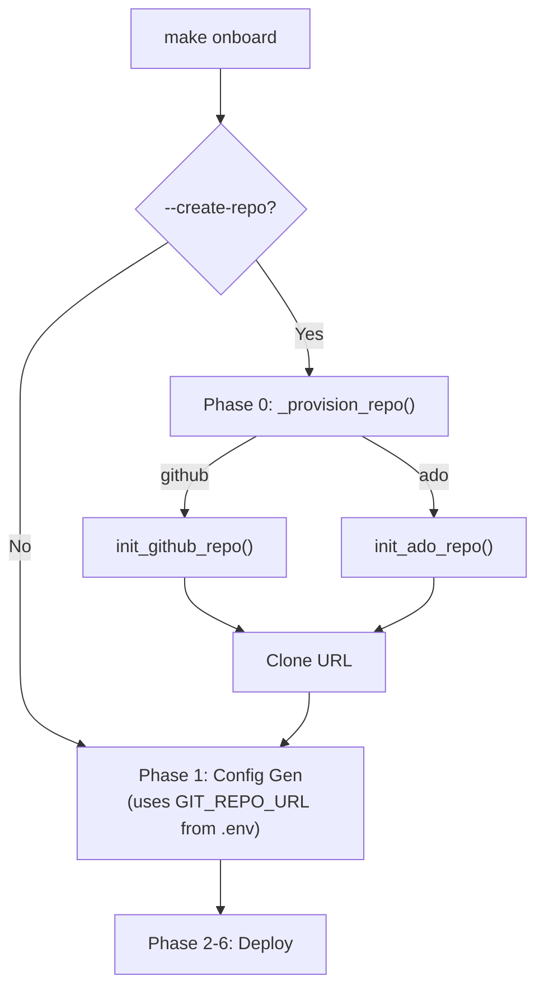

# Walkthrough: Git Repo Isolation — Dual Mode CI/CD

## What Changed

### New File

- [init_github_repo.py](file:///home/sanmi/Documents/J'TOYE_DIGITAL/LEIT_TEKSYSTEMS/1_Project_Rhico/usf_fabric_cli_cicd/scripts/admin/utilities/init_github_repo.py) — GitHub repo init (mirrors ADO script). Idempotent create + branch ensure via GitHub REST API. CLI + programmatic `init_github_repo()` entry-point.

### Modified Files

| File | Change |
|------|--------|
| [init_ado_repo.py](file:///home/sanmi/Documents/J'TOYE_DIGITAL/LEIT_TEKSYSTEMS/1_Project_Rhico/usf_fabric_cli_cicd/scripts/admin/utilities/init_ado_repo.py) | Added `init_ado_repo()` orchestration function returning clone URL |
| [onboard.py](file:///home/sanmi/Documents/J'TOYE_DIGITAL/LEIT_TEKSYSTEMS/1_Project_Rhico/usf_fabric_cli_cicd/scripts/dev/onboard.py) | Phase 0 repo provisioning, `_provision_repo()`, `--create-repo/--git-provider/--git-owner/--ado-project` args |
| [Makefile](file:///home/sanmi/Documents/J'TOYE_DIGITAL/LEIT_TEKSYSTEMS/1_Project_Rhico/usf_fabric_cli_cicd/Makefile) | `onboard-isolated` + `init-github-repo` targets |
| [README.md](file:///home/sanmi/Documents/J'TOYE_DIGITAL/LEIT_TEKSYSTEMS/1_Project_Rhico/usf_fabric_cli_cicd/README.md) | Git Integration Modes section (Shared vs Isolated) |
| [CHANGELOG.md](file:///home/sanmi/Documents/J'TOYE_DIGITAL/LEIT_TEKSYSTEMS/1_Project_Rhico/usf_fabric_cli_cicd/CHANGELOG.md) | Git Repo Isolation + pipeline fix entries |

## Architecture

## Verification

| Check | Result |
|-------|--------|
| `py_compile init_github_repo.py` | ✅ OK |
| `py_compile init_ado_repo.py` | ✅ OK |
| `py_compile onboard.py` | ✅ OK |
| `pytest tests/test_onboard.py` | ✅ 20 passed |
| `pytest tests/test_deployment_pipeline.py` | ✅ 23 passed |

## Next Steps

- `git commit` the changes (pending user review)
- Live test with `make onboard-isolated` against a real GitHub org
