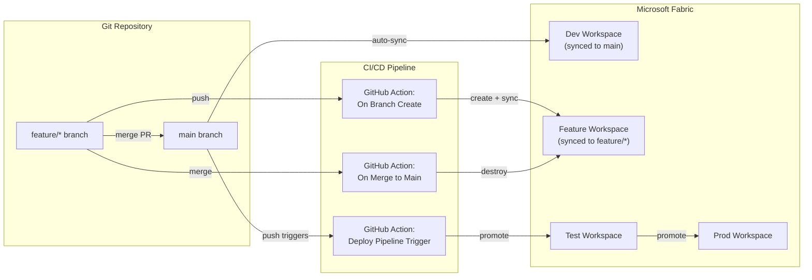

# CI/CD Architecture Refactoring Report — v1.7.0

> **Audience**: Stakeholders, Co-developers, and Contributors
> **Date**: February 2026
> **Branch**: `main` (merged from `feature/cicd-main-centric`)

---

## Executive Summary

Version 1.7.0 implements the **Microsoft-recommended CI/CD architecture** (Option 3) for Microsoft Fabric. The refactoring addresses fundamental flaws in how the project managed workspace lifecycle and environment promotion, replacing manual per-branch workspace creation with an automated, three-phase pipeline.

**Key outcomes:**

- ✅ Dev workspace now connects to `main` (not a feature branch)
- ✅ Feature workspaces are CI/CD-managed (auto-create on push, auto-destroy on merge)
- ✅ Content promotion via Fabric Deployment Pipelines (Dev→Test→Prod)
- ✅ 188 tests passing (23 deployment pipeline + 20 onboard + 5 governance + 142 existing, zero regressions)

---

## Problem Statement (Before)

The previous `onboard.py` script conflated two separate concerns:

1. **Provisioning the Dev workspace** (one-time setup, connected to `main`)
2. **Creating developer-isolated feature workspaces** (on-demand, per feature branch)

Every `make onboard` run created a feature branch, created a new workspace per branch, and connected it to that feature branch:

| Issue | Impact |
|:---|:---|
| No stable Dev workspace connected to `main` | Content couldn't sync to the canonical branch |
| No automatic workspace cleanup | Orphaned workspaces consumed Fabric capacity indefinitely |
| No Deployment Pipeline for stage promotion | Manual, error-prone promotion between environments |
| No CI/CD-driven lifecycle | Everything was manual via `make onboard` |

---

## Target Architecture (After)



---

## Implementation Phases

### Phase 1: Main-Centric Dev Workspace

**Files changed:** `src/usf_fabric_cli/scripts/dev/onboard.py`, `Makefile`

Separated the onboarding script into two distinct modes:

| Mode | Command | Purpose |
|:---|:---|:---|
| **Dev Setup** (default) | `make onboard org="X" project="Y"` | Creates Dev workspace connected to `main` |
| **Feature Workspace** | `make feature-workspace org="X" project="Y"` | Creates isolated workspace per branch (opt-in) |

The default `make onboard` no longer creates feature branches or force-branch workspaces. Feature isolation is available on-demand via the dedicated Makefile target.

---

### Phase 2: Automated Feature Workspace Lifecycle

**New files created:**

| File | Purpose |
|:---|:---|
| `.github/workflows/feature-workspace-create.yml` | Auto-create workspace on `feature/*` push |
| `.github/workflows/feature-workspace-cleanup.yml` | Auto-destroy workspace on PR merge / branch delete |
| `config/environments/feature_workspace.json` | Feature workspace recipe & lifecycle policies |

**CLI enhancement:** Added `--workspace-name-override` to `destroy` command for targeting branch-specific workspaces.

**How it works:**

1. Developer pushes a `feature/*` branch → GitHub Action creates a Fabric workspace, connects it to the branch, and syncs content
2. Developer creates PR and merges → GitHub Action automatically destroys the feature workspace, freeing capacity

---

### Phase 3: Deployment Pipeline Integration

**New files created:**

| File | Purpose |
|:---|:---|
| `src/usf_fabric_cli/services/deployment_pipeline.py` | Service wrapping Fabric Deployment Pipeline REST API |
| `.github/workflows/deploy-to-fabric.yml` | GH Actions: auto Dev→Test + manual promotion |
| `tests/test_deployment_pipeline.py` | 23 unit tests for the deployment pipeline service |

**CLI enhancement:** Added `promote` command:

```bash
# Promote Dev → Test (auto-infers next stage)
usf_fabric_cli promote --pipeline-name "MyPipeline" --source-stage Development

# Promote to specific stage
usf_fabric_cli promote --pipeline-name "MyPipeline" -s Test -t Production
```

**Service capabilities:**

- Pipeline CRUD (list, get, create, delete)
- Stage management (list stages, assign/unassign workspaces)
- Deploy (promote) content between stages with item options
- Long-running operation polling with timeouts
- Token refresh via `TokenManager`
- High-level `promote()` method with automatic next-stage inference

**Promotion flow:**


---

## Verification Results

| Check | Result |
|:---|:---|
| Existing tests (142) | ✅ All pass |
| New deployment pipeline tests (23) | ✅ All pass |
| New onboard tests (20) | ✅ All pass |
| New governance SP tests (5) | ✅ All pass |
| **Total** | **188 passed** |
| Lint compliance (flake8) | ✅ Clean |
| Git Repo Isolation | ✅ `init_github_repo.py` + `--create-repo` flag verified |

---

## Required Configuration (GitHub Secrets)

For the CI/CD workflows to operate, these secrets **must be configured** in the GitHub repository settings:

| Secret | Used By | Purpose |
|:---|:---|:---|
| `AZURE_TENANT_ID` | All workflows | Azure AD tenant |
| `AZURE_CLIENT_ID` | All workflows | Service Principal app ID |
| `AZURE_CLIENT_SECRET` | All workflows | Service Principal secret |
| `FABRIC_CAPACITY_ID` | Feature workspace create | Fabric capacity for workspace creation |
| `FABRIC_GITHUB_TOKEN` | Feature workspace create | GitHub PAT for Git connection |
| `FABRIC_PIPELINE_NAME` | Deploy-to-Fabric | Deployment pipeline display name |

---

## Updated Documentation

All project documentation has been updated to reflect v1.7.0:

| Document | Changes |
|:---|:---|
| `CHANGELOG.md` | Added v1.7.0 entry with all 3 phases |
| `README.md` | Updated version, onboarding section, project structure, CI/CD workflows, CLI flags, features |
| `docs/02_Strategy_and_Architecture/02_AI_Agent_Context.md` | Added main-centric workflow, deployment pipeline promotion, updated directory structure |
| `.github/copilot-instructions.md` | Updated version, added `deployment_pipeline.py`, updated common pitfalls, added promotion docs |

---

## References

- [Microsoft: CI/CD Workflow Options for Fabric](https://learn.microsoft.com/en-us/fabric/cicd/manage-deployment) — **Option 3** selected
- [Microsoft: Git Branch Management in Fabric](https://learn.microsoft.com/en-us/fabric/cicd/git-integration/manage-branches) — **Scenario 2** for feature isolation
- [Microsoft: CI/CD Best Practices](https://learn.microsoft.com/en-us/fabric/cicd/best-practices-cicd) — Workspace reuse, commit isolation
- [PeerInsights: Automating Feature Workspaces](https://peerinsights.emono.dk/automating-feature-workspace-maintainance-in-microsoft-fabric) — Recipe-based lifecycle pattern
